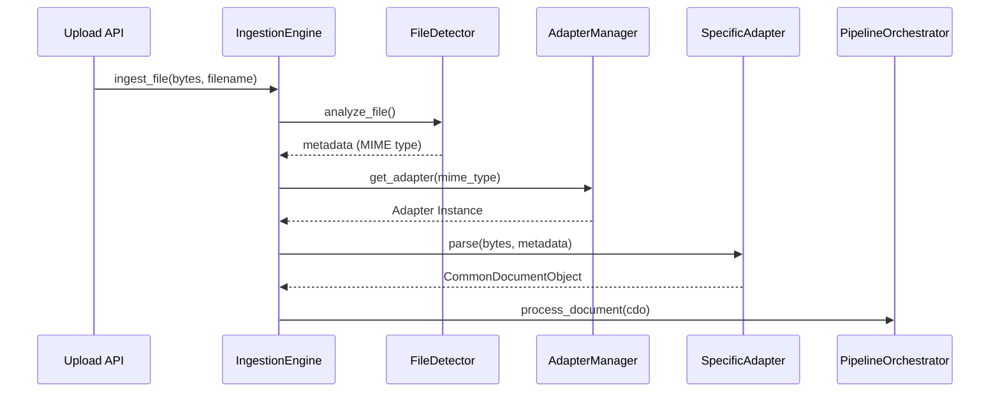

# Unified Ingestion Engine

The Unified Ingestion Engine acts as the single point of entry for all modalities (Images, PDFs, Videos, Audio) into the Document Intelligence Platform.

## Architecture
The engine is completely decoupled from downstream AI models. It has three core responsibilities:
1. Validate the file bytes.
2. Resolve the correct Adapter.
3. Delegate parsing to the Adapter.

## Supported File Types
Determined by `FileDetector.SUPPORTED_MIME_TYPES`. Currently includes standard images, PDFs, office documents, and media files.

## Event Hooks
- `AdapterSelected`: Fired when an adapter is found for a MIME type.
- `DocumentParsed`: Fired when the adapter finishes parsing the file into a CDO.
- `CommonDocumentObjectCreated`: Fired before handing off the CDO to the Orchestrator.
