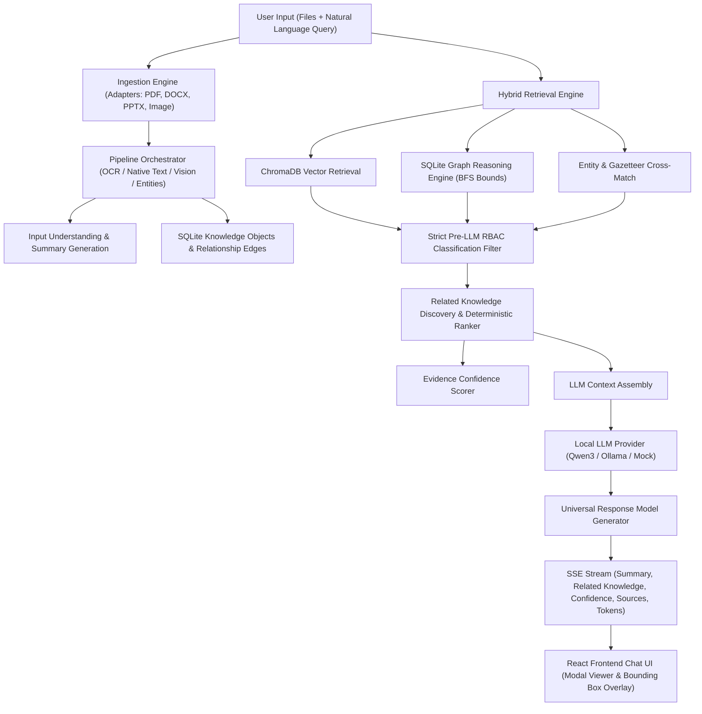

# Universal Multimodal Query & Related Knowledge — Master Implementation Plan

**Goal**: Implement a unified, offline-first Universal Multimodal Query capability allowing users to attach any supported modality (PDF, DOCX, PPTX, image, or multiple files), ask a natural-language question, and receive an evidence-grounded answer, input summary, related authorized documents, related images/visual assets, related entities, graph relationships, structured citations, highlighting metadata, and evidence confidence scores.

---

## 1. System Architecture & Component Interactions



---

## 2. Universal Multimodal Query Service (`UniversalMultimodalQueryService`)

**Location**: `backend/app/core/rag/universal_query.py`

### Responsibilities & Workflow
1. **Input Processing**:
   - Accepts raw uploaded files (or pre-uploaded `document_ids`).
   - If raw file bytes provided, calls `IngestionEngine.ingest_file()` and `PipelineOrchestrator.process_document()` to extract text blocks, tables, images, slides, entities, and bounding boxes. Reuses `DocumentFingerprinter` SHA-256 cache if already indexed.
2. **Input Summary & Understanding**:
   - Generates a concise structural & semantic summary of the supplied input file(s) (e.g., slide count, page structure, key entities detected, visual layout summary).
3. **Hybrid Retrieval**:
   - Executes semantic vector query via `VectorDatabaseManager.semantic_query()` on `document_chunks`.
   - Traverses graph connections via `GraphReasoningEngine.find_neighbors()` and `find_path()`.
   - Matches extracted entities with historical document indices.
4. **Pre-LLM Security & RBAC Enforcement**:
   - Calls `authorize_document_classification(user_context, doc_classification)` on every vector chunk, graph node, image, entity, and document candidate.
   - Unauthorized items are stripped out BEFORE building LLM context prompts.
5. **Related Knowledge Discovery & Ranking**:
   - Ranks authorized related documents, related images/visual assets, related entities, and graph edges using evidence signals:
     - Vector cosine similarity
     - Entity overlap count
     - Graph hop distance
     - Parent document lineage
6. **Confidence & Citations**:
   - Calculates evidence confidence (score 0-100, level `HIGH`/`MEDIUM`/`LOW`) via `EvidenceScorer.calculate_confidence()`.
   - Formats structured citations with document ID, page, slide, bounding box, and text snippet.
7. **Answer Streaming**:
   - Passes authorized context and history to `LocalLLMProvider` for token streaming.

---

## 3. Structured Response Schema (`UniversalMultimodalResponse`)

```python
class RelatedAsset(BaseModel):
    document_id: str
    filename: str
    modality: str
    classification: str
    relevance_score: float
    page_number: Optional[int] = None
    slide_number: Optional[int] = None
    thumbnail_url: Optional[str] = None

class RelatedEntity(BaseModel):
    name: str
    entity_type: str
    mention_count: int
    source_documents: List[str]

class GraphRelationship(BaseModel):
    source_name: str
    relationship: str
    target_name: str
    confidence: float

class UniversalMultimodalResponse(BaseModel):
    trace_id: str
    input_summary: str
    answer: str
    evidence_confidence: Dict[str, Any]
    citations: List[Dict[str, Any]]
    related_documents: List[RelatedAsset]
    related_images: List[RelatedAsset]
    related_entities: List[RelatedEntity]
    relationships: List[GraphRelationship]
    input_objects: List[Dict[str, Any]]
```

---

## 4. API & Communication Layer

### `POST /api/chat` Modifications (`backend/app/api/rag.py`)
- Request JSON Body:
  ```json
  {
    "query": "Compare these architecture documents",
    "file_ids": ["doc_uuid_1", "doc_uuid_2"],
    "session_id": "session_uuid",
    "limit": 5,
    "use_graph_expansion": true
  }
  ```
- SSE Streaming Event Protocol:
  1. `data: {"type": "input_summary", "summary": "Input comprises 1 PDF (3 pages) and 1 PNG architecture diagram."}`
  2. `data: {"type": "related_knowledge", "related_documents": [...], "related_images": [...], "related_entities": [...], "relationships": [...]}`
  3. `data: {"type": "sources", "sources": [...]}`
  4. `data: {"type": "token", "text": "..."}`
  5. `data: {"type": "confidence", "confidence": {...}}`

---

## 5. Security & RBAC Boundary Enforcement

Every candidate object (chunks, related documents, related images, entities, graph edges) must undergo RBAC authorization:

```python
user_ctx = UserContext(id=current_user.id, username=current_user.username, role=current_user.role)
authorized_documents = []
for doc in candidate_documents:
    try:
        authorize_document_classification(user_ctx, doc["classification"])
        authorized_documents.append(doc)
    except HTTPException:
        continue # Unauthorized objects are silently excluded
```

The response will never expose `SECRET` items to users with `VIEWER`, `DOCUMENT_OFFICER`, or `REVIEWER` roles.

---

## 6. Frontend UI Implementation Plan (`App.jsx`)

1. **Multimodal Attachment Widget**:
   - File attachment button (+ icon) next to Chat input box.
   - Allows selecting single or multiple files (PDF, DOCX, PPTX, image).
   - Displays attached file pills with remove (X) button.
   - On send, uploads files via `/api/upload` if needed, then submits `file_ids` with `query` to `/api/chat`.
2. **Rich Chat Response Rendering**:
   - **Input Summary Accordion**: Collapsible card displaying structural breakdown of user-uploaded input files.
   - **Evidence Confidence Badge**: Color-coded pill (`HIGH`: Green, `MEDIUM`: Yellow, `LOW`: Red).
   - **Citations List**: Cards showing source file, page/slide number, and text preview with "View Source" button that opens Inspector Modal with bounding box highlight.
   - **Related Authorized Documents**: Grid of related document cards showing filename, modality icon, classification badge, and "Inspect" button.
   - **Related Visual Assets / Images**: Image thumbnail grid with click-to-preview lightbox.
   - **Related Entities**: Entity tags color-coded by type (`PERSON`, `ORGANIZATION`, `LOCATION`, `DOCUMENT_ID`).
   - **Graph Relationships**: Relationship flow badges (`[Source] --(REL_TYPE)--> [Target]`) with a button to switch to the Graph tab focused on those nodes.

---

## 7. Audit Logging

New audit events recorded via `AuditLogger`:
- `MULTIMODAL_QUERY_STARTED`
- `MULTIMODAL_QUERY_COMPLETED`
- `RELATED_KNOWLEDGE_RETRIEVED`
- `MULTIMODAL_QUERY_FAILED`

Sensitive prompt details and document content are excluded from audit logs.

---

## 8. Test Plan

### Backend Automated Tests (`backend/tests/test_universal_multimodal_query.py`)
1. **Input Modal Handling**: Test PDF + question, DOCX + question, PPTX + question, Image + question, Multi-file + question.
2. **Related Knowledge Retrieval**: Test cross-document retrieval, cross-modal retrieval, related image discovery, entity matching, and graph edge traversal.
3. **RBAC Boundary Enforcement**: Verify `VIEWER` cannot retrieve `SECRET` related documents or graph edges, while `SYSTEM_ADMIN` and `INTELLIGENCE_ANALYST` can.
4. **Citations & Highlighting**: Assert preservation of `document_id`, `page_number`, `slide_number`, `bounding_box`.
5. **Confidence & Caching**: Assert confidence calculation and verify duplicate uploads use `DocumentFingerprinter` cache.

### Frontend Automated Tests (`frontend/src/__tests__/App.test.jsx`)
1. Test file attachment selection and pill rendering in Chat UI.
2. Test SSE streaming for `input_summary`, `related_knowledge`, `confidence`, `sources`, and `token`.
3. Test clicking citation opens Document Inspector Modal.
4. Test displaying Related Documents, Related Images, Entities, and Graph Relationships.

---

## 9. Demonstration Dataset Scenario

Use the existing demo dataset (`backend/demo_dataset/`):
- `National_Surveillance_Architecture.pdf`
- `Surveillance_Implementation_Plan.docx`
- `Surveillance_Briefing.pptx`
- `Command_Center_Diagram.png`

Query:
> "Explain this Command Center architecture diagram and identify all related authorized documents, entities, and graph relationships."

Expected Response:
1. **Input Summary**: Visual analysis of `Command_Center_Diagram.png` identifying layout and components.
2. **Answer**: Grounded explanation of the architecture.
3. **Evidence Confidence**: `HIGH` (92/100).
4. **Related Documents**: `National_Surveillance_Architecture.pdf`, `Surveillance_Implementation_Plan.docx`, `Surveillance_Briefing.pptx`.
5. **Related Images**: Extracted visual assets from PPTX/PDF.
6. **Related Entities**: `NTRO`, `New Delhi`, `Command Center`, `Authentication Server`.
7. **Graph Relationships**: `Command Center CONNECTED_TO Authentication Server`, `National Surveillance Architecture REFERENCES Command Center`.
8. **Citations**: Page 2 of PDF, Slide 3 of PPTX, Section 4 of DOCX with bounding boxes.
